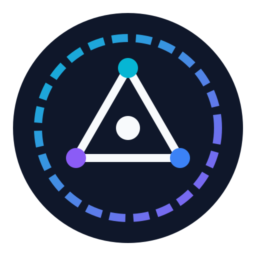
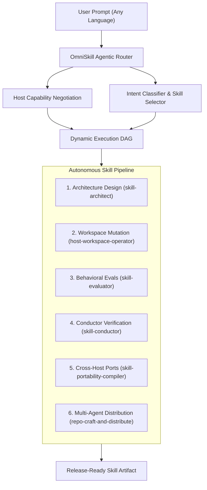

<p align="center">
  
</p>

<h1 align="center">OmniSkill</h1>

<p align="center">
  <strong>Universal Cross-Host Agent Skill Engineering Engine & Compiler</strong>
</p>

<p align="center">
  <a href="#installation">Installation</a> •
  <a href="#all-agents-support">All Agents Support</a> •
  <a href="#features">Features</a> •
  <a href="#architecture">Architecture</a> •
  <a href="#cli-usage">CLI Usage</a> •
  <a href="#skills-suite">Skills Suite</a> •
  <a href="#license">License</a>
</p>

<p align="center">
  
  
  
  
  
</p>

---

## Overview

**OmniSkill** is the universal cross-host standard and compiler for AI Agent Skills. It enables developers to design, test, verify, compile, and package high-reliability skills across every AI coding agent and LLM platform with zero lock-in.

$$\text{Intent} \longrightarrow \text{OmniSkillSpec} \longrightarrow \text{BinEval Harness} \longrightarrow \text{Cross-Host Compiler} \longrightarrow \text{Release (All Agents)}$$

---

## Installation

### 1. 1-Click Skills.sh (Vercel Registry)
```bash
npx skills add imMamdouhaboammar/omni-skill
```

### 2. Homebrew (macOS & Linux)
```bash
brew tap imMamdouhaboammar/omni-skill https://github.com/imMamdouhaboammar/omni-skill
brew install omni-skill
```

### 3. Universal 1-Line Curl Installer
```bash
curl -fsSL https://raw.githubusercontent.com/imMamdouhaboammar/omni-skill/main/install.sh | bash
```

### 4. Bun / npm / npx
```bash
# Ad-hoc execution via Bunx
bunx @omni-skill/cli --help

# Install globally via Bun
bun add -g @omni-skill/cli
```

*For precompiled standalone binaries (macOS, Linux, Windows), see [INSTALLATION.md](INSTALLATION.md).*

---

## All Agents Support

OmniSkill compiles and validates native plugin manifests and behavioral directives for:

| AI Agent / IDE | Integration Surface | CLI Target Flag |
|---|---|---|
| **ChatGPT & OpenAI Codex** | `.codex-plugin/plugin.json` | `--target chatgpt` / `codex` |
| **Claude Code** | `.claude-plugin/plugin.json` + `marketplace.json` | `--target claude` / `claude-code` |
| **Google Antigravity & Gemini CLI** | `.gemini/plugin.json` + auto-injected hooks | `--target antigravity` / `gemini` |
| **Cursor IDE** | `.cursorrules` + `.cursor/rules/` | `--target cursor` |
| **Codeium Windsurf** | `.windsurfrules` | `--target windsurf` |
| **Cline & Roo Code** | `.clinerules` | `--target cline` / `roo` |
| **GitHub Copilot** | `.github/copilot-instructions.md` | `--target copilot` |
| **OpenCode & DeepSeek** | `.opencode/skill.json` | `--target opencode` |
| **Agent Skills Standard** | `.agents/plugins/marketplace.json` | `--target agent-skills` |

*See [ADAPTERS.md](ADAPTERS.md) for detailed adapter guides.*

---

## Skills Suite

OmniSkill includes eight modular, certified sub-skills:

| Skill | Directory | Job |
|---|---|---|
| **`omni-skill`** | [`skills/omni-skill`](skills/omni-skill) | Master orchestrator and lifecycle router (`CREATE`, `IMPROVE`, `VALIDATE`, `REVIEW`, `OPTIMIZE`, `PORT`, `PACKAGE`, `DISTRIBUTE`). |
| **`skill-conductor`** | [`skills/skill-conductor`](skills/skill-conductor) | Full lifecycle conductor: BinEval scoring, trigger optimization loops, and automated packaging. |
| **`repo-craft-and-distribute`** | [`skills/repo-craft-and-distribute`](skills/repo-craft-and-distribute) | High-presence GitHub repo crafter, Mermaid guard, and universal multi-agent manifest distributor (Claude, Skills.sh, npm, Cursor, Codex). |
| **`skill-architect`** | [`skills/skill-architect`](skills/skill-architect) | Architecture-first design, workflow/SOP compilation, and freedom calibration. |
| **`skill-evaluator`** | [`skills/skill-evaluator`](skills/skill-evaluator) | Activation trigger banks, BinEval assertions, held-out splits (70/30), and pressure testing. |
| **`skill-portability-compiler`** | [`skills/skill-portability-compiler`](skills/skill-portability-compiler) | Cross-host adapter compiler generating target manifests and capability gap reports. |
| **`host-workspace-operator`** | [`skills/host-workspace-operator`](skills/host-workspace-operator) | Safe, read-first workspace operations mapped to host-native capabilities. |
| **`sandbox-python-executor`** | [`skills/sandbox-python-executor`](skills/sandbox-python-executor) | Deterministic Python helper for parsing, hash verification, archive inspection, and verification. |

---

## ⚡ Dynamic Agentic Router

OmniSkill includes an intelligent, autonomous intent router that dynamically translates user requests in any natural language into optimal multi-step skill execution DAGs:



---

## CLI Usage

```bash
# 1. Dynamic Agentic Router: Plan execution DAG from natural language
omni-skill route "Build a PDF parser skill and publish to GitHub and Skills.sh" --explain
omni-skill route "Port my existing skill to Cursor and Claude Code" --json

# 2. Initialize a new skill package
omni-skill init my-awesome-skill -d "High-performance data analyst skill"

# 3. Validate skill structure, frontmatter, security, and portability
omni-skill validate skills/omni-skill

# 4. Run BinEval test harness
omni-skill eval skills/omni-skill

# 5. Port a skill to any AI agent (ChatGPT, Codex, Claude, Cursor, Windsurf, Antigravity)
omni-skill port examples/sql-optimizer --target cursor
omni-skill port examples/sql-optimizer --target chatgpt
omni-skill port examples/sql-optimizer --target claude

# 6. Package a release-ready artifact
omni-skill package skills/omni-skill
```

---

## Testing & Quality Assurance

Run the comprehensive test suite across all engines:

```bash
# Run Bun unit tests (CLI, parsers, validators, adapters)
bun test

# Run Python engine tests
python3 packages/core/test_engine.py

# Validate all skills against multi-host profiles
bun run validate:all
```

---

## License

Distributed under the [MIT License](LICENSE). See [PRIVACY.md](PRIVACY.md), [TERMS.md](TERMS.md), and [SUPPORT.md](SUPPORT.md).
