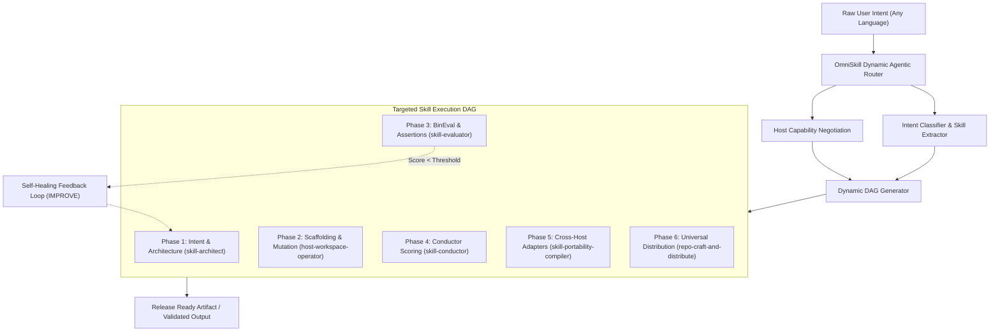

# OmniSkill Dynamic Agentic Router Specification

This document provides the definitive specification for how AI agents (Claude Code, Antigravity, ChatGPT/Codex, Cursor, Windsurf, OpenCode) must dynamically route user intents into optimal skill execution graphs.

---

## 1. Core Routing Architecture

---

## 2. Intent to Sub-Skill Mapping Matrix

| Classified Intent | Primary Sub-Skill | Supporting Sub-Skills | Minimal Context References |
|---|---|---|---|
| **`CREATE`** (New skill from prompt/script) | `skill-architect` | `host-workspace-operator`, `skill-evaluator`, `skill-conductor` | `references/skill-spec.md`, `references/sop-practices.md` |
| **`IMPROVE`** (Fix bugs, undertriggering, failure) | `skill-conductor` | `host-workspace-operator`, `skill-evaluator` | `references/pressure-testing.md`, `references/patterns.md` |
| **`VALIDATE` / `EVAL`** (Run checks & BinEval) | `skill-evaluator` | `skill-conductor`, `sandbox-python-executor` | `references/bineval-method.md`, `references/schemas.md` |
| **`OPTIMIZE`** (Description tuning & train/test) | `skill-conductor` | `skill-evaluator` | `references/sop-practices.md`, `references/bineval-method.md` |
| **`PORT`** (Cross-host adaptation) | `skill-portability-compiler` | `host-workspace-operator`, `skill-evaluator` | `references/host-profiles.md`, `references/cross-host-evaluation.md` |
| **`PACKAGE`** (Bundle .skill / plugin) | `skill-conductor` | `sandbox-python-executor` | `references/runtime-setup.md`, `references/schemas.md` |
| **`DISTRIBUTE`** (GitHub repo, manifests, Skills.sh) | `repo-craft-and-distribute` | `skill-conductor` | `references/multi-agent-manifests.md`, `references/readme-standards.md`, `references/github-workflow-and-metadata.md` |

---

## 3. Host Capability Negotiation Rules

When executing on a specific AI host, adapt the execution model:

1. **Claude Code / Desktop**:
   - Prefer subagent delegation when multi-step tasks are independent.
   - Use `SKILL.md` directly; manifest via `.claude-plugin/plugin.json`.
2. **Antigravity / Gemini CLI**:
   - Enforce Compound Engineering loop (80% planning/review, 20% execution).
   - Use `bun` first; verify with `eval_skill.py`.
3. **OpenAI Codex / ChatGPT**:
   - Adhere to single-file constraints where applicable; output `.codex-plugin/plugin.json`.
4. **Cursor IDE / Windsurf**:
   - Compile rules to `.cursorrules` / `.windsurfrules` with explicit file-scoping regexes.

---

## 4. Self-Healing & Fallback Policies

If any step in the DAG fails:
1. **Never guess or repeat the identical command**.
2. **Isolate Root Cause**: Check if failure is due to missing prerequisites (`runtime-setup.md`), syntax violation, or token bloat.
3. **Trigger Remediator**: Route back to `IMPROVE` or `OPTIMIZE` with the exact error log as the failure baseline before re-running verification.
